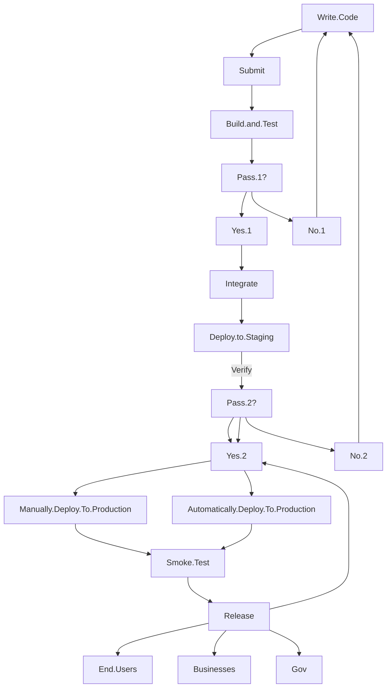

  #    GLH-Exit

Netcom GLH & Exit Tickets

 

My GLH & Exit Tickets stating what I learnt each day. 
*Click on date to see full description*

|     **Date**       |    **Subject**      |        *Breif descritption on subjects covered*               |
|--------------------|---------------------|---------------------------------------------------------------|
|[22/01/23](#w6d3)   | Python              | Python, Debugging, System Admin, Cloud9 Labs, VSCode    |

***
***

<a id="w6d3"/>
<h5 align="right">Date: 23/01/23</h5>                                                                               
<h5 align="left">Subject: Python Programming</h5>

Today we continued learning about python. We learnt how to debug and test programs. We made systems admin program that adds a user, deletes user, and adds user groups. We also did labs to debug Caesar cipher that had bugs in it. We used cloud 9 platform and VS. Code to debug the programs. We also learned more in depth about the CI CD process. CI/CD is a method to frequently deliver apps to customers by introducing automation into the stages of continuous delivery, and continuous deployment.

Below is a diagram of my understanding of the CI CD and the other CD process.:

Continuous Integration, Continuous Delivery, and Continuous Deployment

